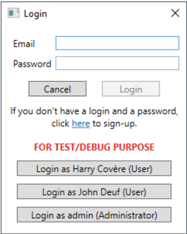
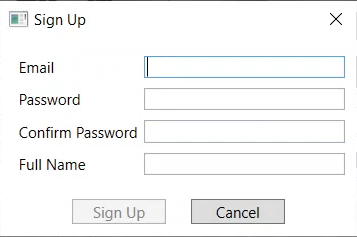
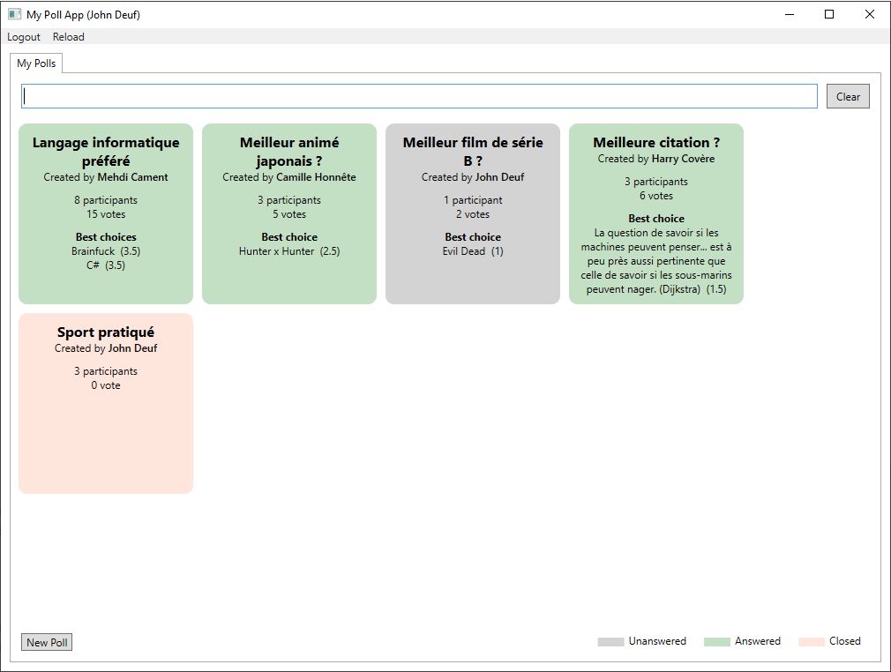
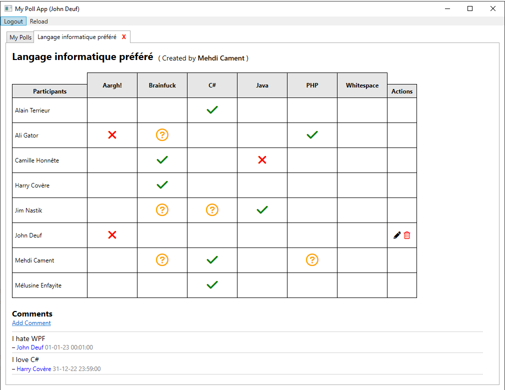
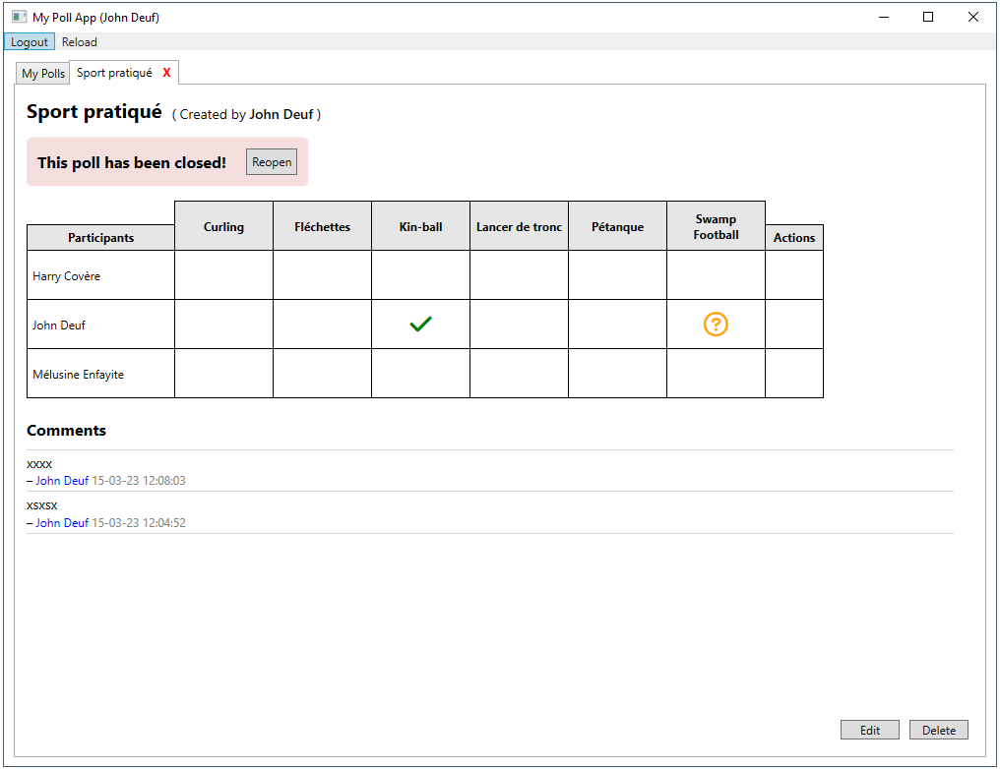
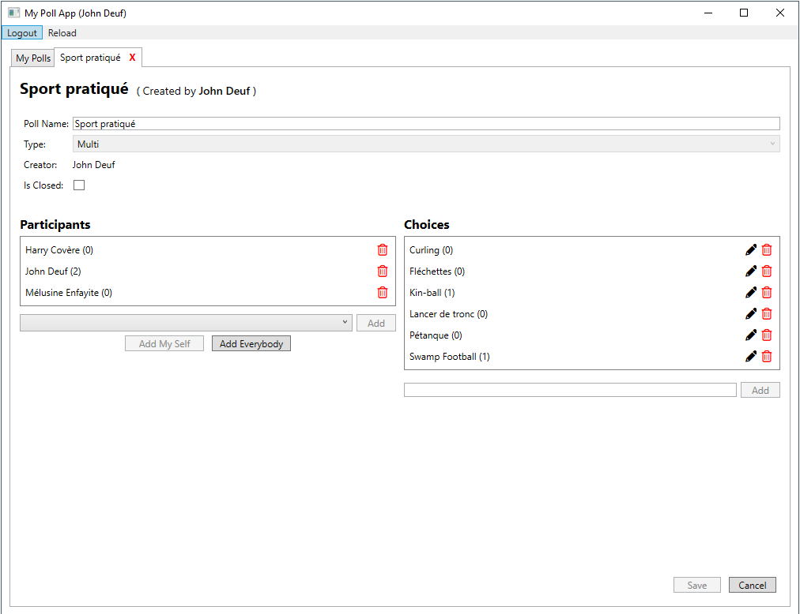

# Desktop Application Polls
Poll Management Application with Voting, Comments, and Administrative Features

## Technologies
* .NET 7.0
* Entity Framework Core 7.0.1
* WPF

## App
The application manages users, each characterized by a unique identifier, a name, an email, and a password. Some users are assigned the role of administrator, granting them expanded access rights compared to regular users.

A poll is identified by a unique ID, a title, and a type (explained below). It is associated with a creator, who is a user. Additionally, the poll has a boolean attribute that indicates whether it is closed (a closed poll remains visible to its creator and participants but cannot be modified).

The creator of a poll can assign multiple users (including themselves) as participants.

Each poll consists of a set of choices that participants can vote on. A choice is defined by a unique ID and a label.

Votes record the selection made by a specific user for a specific choice, with options being "Yes," "No," or "Maybe." If a user has not voted for a choice, this is represented by the absence of an entry for that user and that choice in the voting table.

To identify the most popular choice(s) in a poll, the application calculates the sum of the votes, assigning the following values: "Yes" = 1, "Maybe" = 0.5, and "No" = -1. The choice(s) with the highest total are deemed the most popular (choices with no votes are excluded from consideration).

The poll type can be either "single" or "multiple," depending on the number of choices a participant can vote for simultaneously. In a "single" poll, participants can vote for only one choice, while in a "multiple" poll, they can vote for several choices.

Participants in a poll can also post comments. Each comment is defined by its content and the date/time it was created.

### Login

### Signup

### PollList

### Poll

### ClosedPoll

### PollDetails
